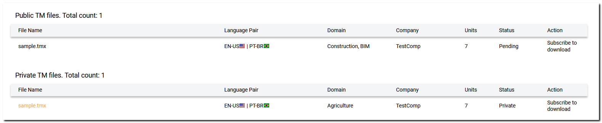
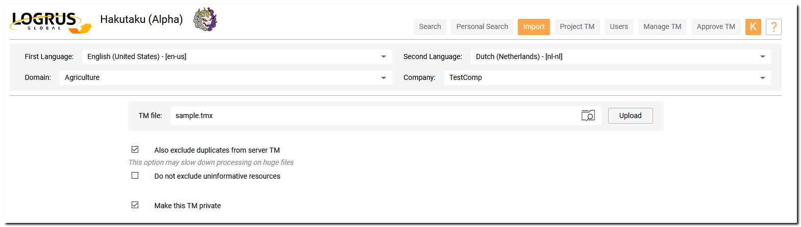
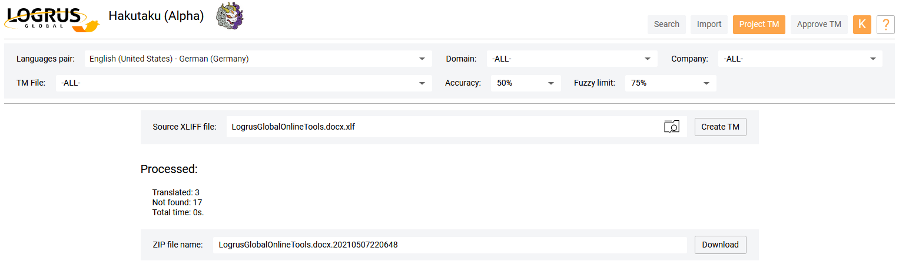
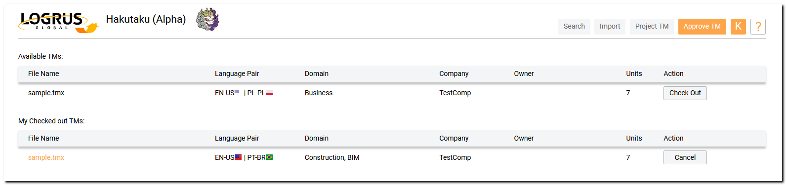
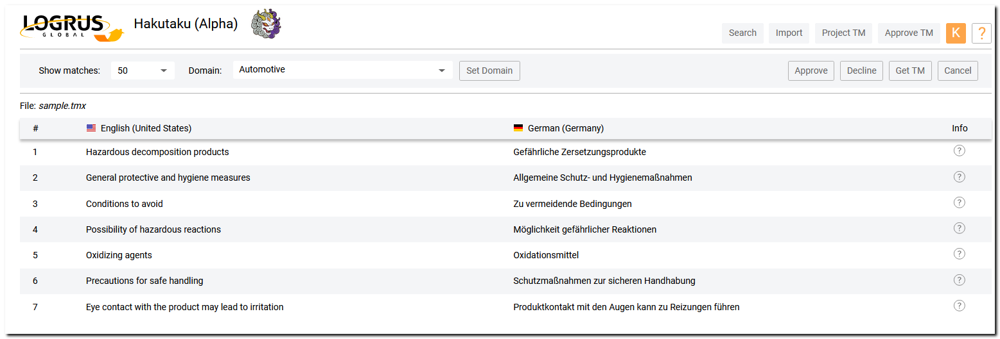
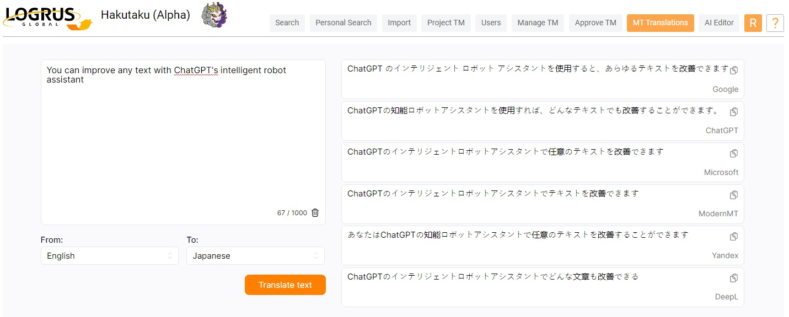
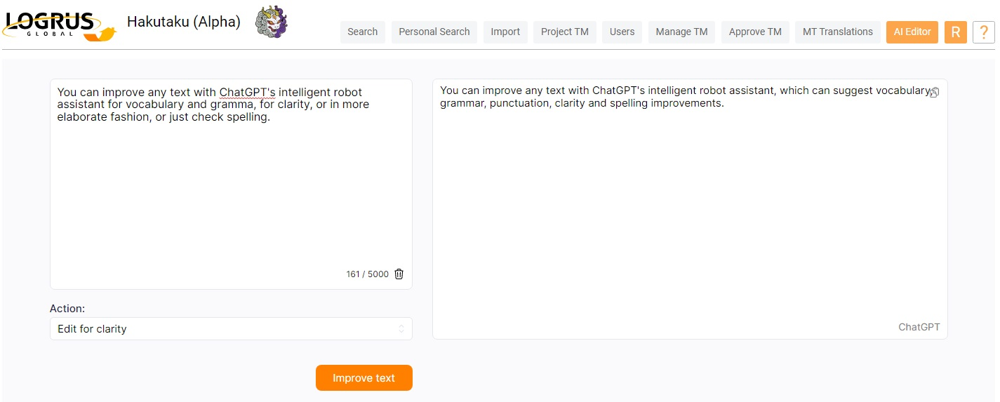
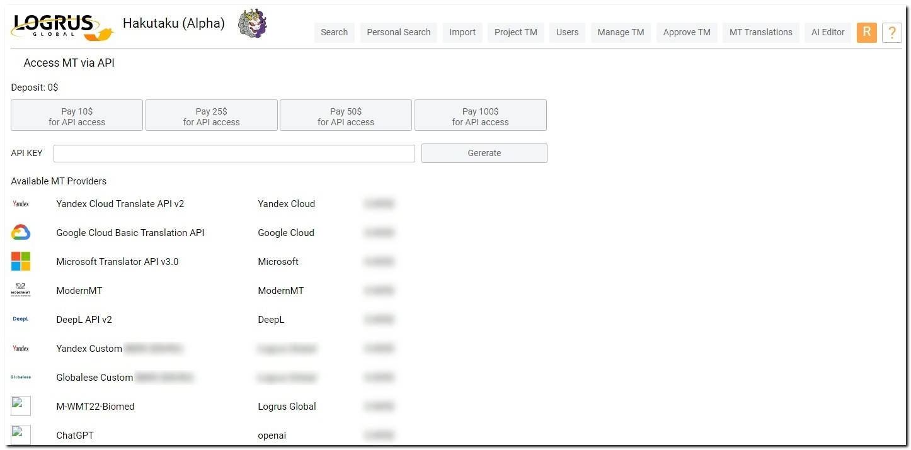

# Hakutaku: Cloud-based Translation Memory Storage

**Hakutaku** is a cloud-based solution for any **TM** storage and management problems that you or your organization may encounter. It offers free access to a public **TM** repository to all users, with private **TM** repositories and other features reserved for subscription users.

## Advantages of Hakutaku

- You can quickly **translate a pieces of text** using **Instant MT Translations** from the best providers.

- You can **polish content** in any language in the way you want with **ChatGPT Editor**.

- **MT Translations API Hub** allows you to implement **machine translation assistants** in your IT services.

- The Hakutaku **public TM repository** is available for everyone to search in for free.

- Any **companies or freelancers** may use the public Hakutaku TM repository for storing their publicly available **industry-spesific TMs**, accumulating knowledge over time and creating reliable databases for medicine, sports, etc.

- Public **non-profit organizations** may store their TM in the public repository, speeding up **community translation projects**.

- **NLP researchers and data engineers** will be able to obtain, store and clean corpora **to train Machine Translation systems**.

- Any **companies (LSPs and LSP clients) or freelancers** may use Hakutaku as their **private TM repository** instead of purchasing any TM servers. These TMs will not be accessible to other users. Hakutaku may serve as their **private TM Server** with its search functions and **Project TM** creation capability.

- **Freelancers** may find eployment in building up **private TM repositories for their clients**.

## User Roles

**Hakutaku** offers a variety of user roles. It is possible to search the public **TM** database without even registering a user account - however, if you register an account, additional functions will become available to you. Even more functions, most notably the private **TM** repository and the **Project TM** creation capability, are reserved for subscription users.

The public **TM** respository submissions are moderated by volunteers. Any user can apply to become an **External Moderator**, with possible elevation to **Reliable Moderator** status in the future.

|  | Unregistered User | Registered User | Paid User | External Moderator | Reliable Moderator |
| --------------- | -------------------- | ------------------------- | ----------- | ----------- | ----------- |
| Search | Search only | Search only | Search-based TM downloading | Search-based TM downloading | Search-based TM downloading |
| Project TM | n/a | n/a | Full Availability | Limited Availability | Limited Availability |
| TM Importing | n/a | Import < 10Mb | Import any amount of TM | Import < 100Mb | Import < 100Mb |
| Users | n/a | n/a | n/a | n/a | n/a |
| TM Management | n/a | n/a | n/a | n/a | n/a |
| TM Approval | n/a | n/a | n/a | Uses a personal TM approval page, based on the language filter, with a personal checkout table | Uses a personal TM approval page, based on the language filter, with a personal checkout table |
| Approve View | n/a | n/a | n/a | Available without the Get TM button | Available with the Get TM button |
| Profile PAge | n/a | Profile page available | Profile page available | Profile page available | Profile page available |
| Private TM | n/a | n/a | Avaialble | n/a | n/a |

## Registration

While **Hakutaku** is open to everyone, importing data into the public **TM** database or applying to become a moderator is only possible with registration. Press the **Login** button, and then the **Registration** button in the **Login** screen. You will be required to provide your first and last name, as well as your E-mail address and mobile phone number, both of which will need to be verified via the codes that will be delivered to them. Of course, you will also be required to read our **Terms and Conditions of Use**, agree with them, and set your password.

## Account Management and Subscription

While logged in, you can access your personal account by pressing the button at the top right corner of the screen that has the first letter of your e-mail address on it. There, you can manage your personal information (your name, address, email, company and phone number), see your user role, pay for subscription time, select the language pairs that you work with, and create a request to become a moderator. 

Currently, we accept payments of $10 or $100 for extending your subscription time by 1 month and 1 year, respectively. Clicking either of the payment buttons takes you to the payment screen.

You are required to fill in your entire personal information (with the exception of the **Middle Name** text box) to create a request to become a moderator. You do not need to have a subscription for such a request. Moderator applications are decided upon by **Administrators**.

If you have uploaded any **TM** files, whether it was to the public **TM** repository or your private one, you will be able to see the files in the **Account Management** tab. For public **TM** files, the approval status will be visible in the **Status** column. As a subscription user, you will have the ability to download any of these files at any time.

## User Experience

There are the following **Main Menu Tabs** in the Hakutaku that are available to the users and moderators:
- **Search**
- **Personal Search**
- **Import**
- **Project TM**
- **Users**
- **Manage TM**
- **Approve TM**
- **MT Translations**
- **AI Editor**

Availability of each tab depends on the user role as described in the **User Roles** table.

### The Search Tab

Here, you can search the public **TM** database. Use the drop-down menus in the top part of the screen to narrow down your search by choosing the language pair to be used, the domain and company your interest lies in, the particular public **TM** file and the degree of accuracy of your search, as well as the amount of matches listed on one page. If you're uncertain, you can search through "-ALL-" the domains, **TM** files or companies at once. Then, enter your query in either of the languages of the pair into the left or right text box. The search results are updated every time you make a selection in the drop-down menus, press ENTER after typing into a text box, or press the **Search** button. The button between the two textboxes flips the language pair around. The "cross" button resets the search query.

If you hold the cursor over the **(?)** symbol in the **Info** column for any of the records, a tooltip with detailed information on this record will be displayed, listing its domain, company, source **TM** file and owner (the user that had imported the record into the public **TM** database).

With a paid subscription, you will have the ability to download the results of your query. Download links for the TMX and XLSX **TM** formats will appear at the bottom of the results list after a search request is executed.

### The Personal Search Tab

This is a variant of the **Search tab**, similar in all respects, with the exception of accessing your private **TM** repository instead of the public one. It is only available to subscription users.

### The Import Tab

This tab is not available to unregistered users. Here, you can import files containing **TM** into the public database of **Hakutaku**, as well as into your private repository if you own a subscription. This import function supports the TMX, TSV, HTM and XLS file formats.

To import a **TM** file, you need to set the language pair, as well as select the domain and company that your **TM** file will belong to. There is only a set list of domains to choose from, but a new company name may be typed in. 

There are several special options for the import process, available as checkboxes:

- The "Also exclude duplicates from server TM" option will run a search through existing public **TM** files to remove all duplicate records after the file has been approved;

- The "Do not exclude uninformative resources" option will stop the discarding of records that don't seem to contain translation memory data;

- The "Make this TM private" option is only available to subscription users, and will make the uploded **TM** file private, available to you alone and excluded from the public database. If this option is combined with the duplicate exclusion option, then the private **TM** file will only contain non-duplicate records.

After setting up the options, choose a file to be uploaded and press **Upload**. You will be asked to confirm your selection of a language pair, and, after the upload is complete, you will be able to download an information file containing the statistics for this upload (records added, duplicates removed and uninformative records excluded, as well as total processing time).

There is a limit to the size of the **TM** files that you may upload. A registered user may upload files with the size of 10 Mb or less, and a moderator may upload 100 Mb or less. Subscription users are not limited on the upload size.

After a public **TM** file has been uploaded, it will need to receive approval from a moderator before becoming a part of the public **TM** database. You will recive an email message upon approval or denial of your **TM** file.

### The Project TM Tab

This tab is available to subscription users, as well as moderators. If you have a list of terms that you'd like to turn into a translation memory for a particular language - perhaps for use in a third-party CAT tool - you can do this here. The primary function of the **Project TM** tab provides you with a **TM** file constructed from the resources available in the public database using your list of terms in the form of an XLIFF file.

Select the language pair you need and, optionally, set the parameters to limit the search for terms: the **Domain**, the particular public **TM File**, the **Company**, the **Accuracy** and **Fuzzy limit** to use. Then, upload the XLIFF file containing your terms and press the **Create TM** button. 

After the search is concluded, press the **Download** button. You will receive an archive containing a complete **TM** file in the XLSX format, as well as two other XLSX files: one with the terms that were not found in the public database, and another with statistical data. The archive will also contain the original XLIFF file.

### The Users Tab

Administrator can add, edit, assign roles, and remove the users of their organization (company).

### The Manage TM Tab

The TM owners can download or delete their public or private TMs depending of their user role and access level.

### The Approve TM Tab

This tab is only available to moderators. If you have been approved for the role of an **External or Reliable Moderator**, you can access it in order to check any **TM** files that have been submitted by the users.

This tab consists of two lists: **Available TMs** and **My Checked Out TMs**. In the first one, you can see all the submitted **TM** files with language pairs that match the set of languages in your **Profile**. Of course, you can only see the files that have not been checked out by other moderators. Simply click the **Check Out** button in the Action column to check out a file. Every time you check out a **TM** file, or have one assigned to you by an **Administrator**, you receive an email message containing its description and a link to the **Approve TM** tab.

When a file is checked out, it is moved to the **My Checked Out TMs** table, and it becomes unavailable to other moderators.  Every file name in this table is a hyperlink that takes you to the **Approve View** screen where you can see the entirety of the **TM** file and decide if it should be approved ot not. Using the **Domain** drop-down menu and the **Set Domain** button, you can change the domain that the **TM** file belongs to. Click the **Approve** button or the **Decline** button once you have made your final decision. **Reliable Moderators** also have access to the **Get TM** button, which enables them to download the **TM** as a TMX file and check it using third-party instruments.

A checked out **TM file** may be returned without approving or declining it by clicking the **Cancel** button on the **Approve View** screen, or the one on the main screen of the **Approve TM** tab, in the **Action** column of the **My Checked Out TMs** table.

### The MT Translations Tab

Here you can instantly translate an arbitrary piece of text using several machine translation systems and choose the best one. To do this, follow these steps: 
- Type or copy up to 1000 characters of text in the source language.
- Select the source and target languages.
- Click **Translate Text** button.
- Get machine translation variants from several leading providers, including ChatGPT, Google, Microsoft, ModernMT, Yandex, DeepL. Each MT engine panel has a **Copy to Clipboard** button.

### The AI Editor Tab

Here you can improve any text with ChatGPT's intelligent robot assistant. To do this, follow these steps:
- Type or copy up to 5000 characters of text in any language.
- Select the scenario according to which your text will be rewritten.
- Click **Improve Text** button.
- Get the result, which you can copy to the clipboard using the special button.

Text editing scenarios:
- Edit for vocabulary and gramma
- Edit for clarity
- Check spelling
- Edit on more elaborate fashion

## MT Engines API

In your personal account, you can get API access to the leading machine translation providers, including ChatGPT, Microsoft Translator, Google, ModernMT, DeepL, Yandex.

Through this API, you can enhance any service in your enterprise network with machine translation capabilities.

To obtain prepaid access to API Hub, follow these steps:
- Make an initial deposit using one of the buttons **Pay…$**.
- Click the **Generate** button to create an API key.
- Copy and store the API key in safe place.
- Use this API key when connecting your services to our **MT Engines API Hub**.
- Track the usage of your deposit.

