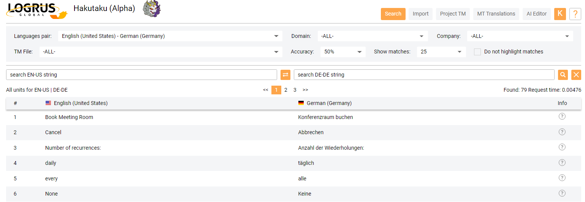

# Hakutaku: Cloud-based Translation Memory Storage

**Hakutaku** is a cloud-based solution for any **TM** storage and management problems that you or your organization may encounter. It offers free access to a public **TM** repository to all users, with private **TM** repositories and other features reserved for paid customers.

## Advantages of Hakutaku

- The public **TM** repository of **Hakutaku** is open for everyone to search in, registration being optional.

- Any companies (LSPs and LSP clients) or freelancers may use **Hakutaku** as a private **TM** repository instead of purchasing an SDL server. These **TM** will not be accessible to other users. **Hakutaku** may serve as their private **TM Server** with its search functions and **Project TM** creation capability.

- Any companies or freelancers that desire common availability of **TMs** may use the public **Hakutaku** **TM** repository for storing their industry-related arrays of **TM**, accumulating knowledge over time and creating reliable **TM** bases for BIM, medicine, sports etc.

- Public non-profit organizations may store **TM** in the public repository, speeding up community translation.

- Freelancers may find eployment in building up private **TM** repositories for clients.

- Researchers and engineers will be able to obtain **TM** data for training topical translation engines.

## User Roles

**Hakutaku** offers a variety of user roles. It is possible to search the public **TM** database without even registering a user account - but if you do, you will receive additional functions. Even more functions, most notably the private **TM** repository, are available upon paying for a subscription. 

The public **TM** respository submissions are moderated by volunteers. Anyone can apply for moderator status, which will be discussed later in detail.

The Internal User and Administrator roles are reserved for Logrus Global employees.

|  | Unregistered User | Registered User | Paid User | External Moderator | Moderator | Internal User | Administrator |
| --------------- | -------------------- | ------------------------- | ----------- | ----------- | ----------- | ------------------ | ----------- |
| Search | Search only | Search only | Search-based TM downloading | Search-based TM downloading | Search-based TM downloading | Search-based TM downloading | Search-based TM downloading, TM editing |
| Project TM | n/a | n/a | Full Availability | Limited Availability | Limited Availability | Full Availability | Full Availability |
| TM Importing | n/a | Import < 10Mb | Import any amount of TM | Import < 100Mb | Import < 100Mb | Non-moderated importing | Non-moderated importing |
| Users | n/a | n/a | n/a | n/a | n/a | n/a | User role management |
| TM Management | n/a | n/a | n/a | n/a | n/a | n/a | Can download or remove any public TM |
| TM Approval | n/a | n/a | n/a | Uses a personal TM approval page, based on the language filter, with a personal checkout table | Uses a personal TM approval page, based on the language filter, with a personal checkout table | n/a | Can see the entire TM approval table, can change approval status |
| Approve View | n/a | n/a | n/a | Available without the Get TM button | Available with the Get TM button | n/a | Full availability |
| Profile PAge | n/a | Profile page available | Profile page available | Profile page available | Profile page available | Profile page available | Every user profile avaialble |
| Private TM (UNDER DEVELOPMENT) | n/a | n/a | Avaialble | n/a | n/a | n/a | Available |

## Registration

While **Hakutaku** is available to unregistered users, in a limited fashion, you will only be able to import data into the public **TM** database or apply to become a moderator if you become a registered user. Press the **Login** button, and then the **Registration** button in the Login screen. You will be required to provide your first and last name, as well as your E-mail address and mobile phone number, both of which will need to be verified via the codes that will be delivered to them. Of course, you will also be required to read our Terms and Conditions of Use, agree with them, and set your password.

## Account Management and Subscription

You can access your personal information screen by pressing the button that has the first letter of your e-mail address in it. There, you can manage your personal information (your name, address, email, company and phone number), see your user role, pay for subscription time, select the language pairs that you work with, and create a request to become a moderator. 

You are required to fill in your entire personal information (with the exception of the **Middle Name** text box) to create such a request; however, you do not need to be a subscription user.

## User Experience

There are seven primary tabs in the **Hakutaku** UI.  Their availability varies greatly for different roles, as seen in the table above. For example, registered users only have access to the **Search** and **Import** tabs.

### The Search Tab

Here, you can search the public **TM** database. Use the drop-down menus in the top part of the screen to narrow down your search by choosing the language pair to be used, the domain and company your interest lies in, the particular public TM file and the degree of accuracy of your search, as well as the amount of matches listed; if you're uncertain, you can search through "-ALL-" the domains, TM files or companies at once. Then, enter your query in either of the languages of the pair into the left or right textbox. The search results are updated every time you make a selection in the drop-down menus, press ENTER after typing into a text box, or press the **Search** button. The button between the two textboxes flips the language pair around. The "cross" button resets the search query.

If you hold your cursor over the (?) symbol in the **Info** column for any of the records, a tooltip with detailed information on this record, listing its domain, company, TM file and owner (the user that had imported the record into the public **TM** database), will be displayed.

If you have a paid subscription, you will have the ability to download your search results as a TM file.

### The Import Tab

This tab is not available to unregistered users. 