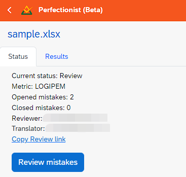

# Perfectionist: a cloud-based LQA Tool

**Perfectionist** is a Web service for measuring translation quality, post editing quality, and raw machine translation quality. 

With this service you can:
- Outsource LQA tasks to internal and third-party experts
- Review random translation samples of given size
- Exclude repeated translation units from the scope of review
- Keep track of reviewes in the LQA reports repository
- Download LQA reports

For translation quality evaluation, you can choose from several embedded quality metrics:
- standard LQA metrics based on MQM error typology
- advanced LOGIPEM metrics for most adequate and precise quality evaluation of raw and post edited machine translation
- any user-defined metrics (by request)

The service is built in accordance with the most recent proceedings of ASTM International Committee F43 featuring an advanced analytic-holistic LQA methodology.

For enterprises, any customizations of the service functionality can be provided upon request.

## Supported File Formats

You can review bilingual files of the following formats: 
- **XLSX** (a sample is available on the requestor page)
- **XLIFF**, **XLF**, **SDLXLIFF**, **TSV**

# User Account and Role

**Perfectionist** uses the same user accounts as the https://cloud.logrusglobal.com/ portal. 

A user will have one of three roles: **Requestor**, **Reviewer** or **Stakeholder**.

## Requestor

A **Requestor** operates the **Requestor Room** page at https://lqa.logrusglobal.com/requestor-room. This user role has the capability of creating new LQA projects and new testing projects for evaluating personnel.

### Creating New Projects

This is done by using the **Create Project** button on the top right of the screen. 

This button calls a simple dialog window where you can name the new project.

After you have named the new project, it will appear in the **Requestor Room**'s table of projects. Each line in the table represents a different project, lists its type and number of tasks (files) in in, as well as enables the **Reviewer** to download its results or delete it.

Clicking on a name of a new project with zero tasks brings you to the **New Job** window, where you can set the project up with tasks. The sample.xlsx file is also available there.

Clicking the **Create** button calls up a special dialog box where you can drag and drop suitable bilingual files; you can also click on the box itself to call up a standard Explorer interface to look for the files you need.

All repeated translation units are excluded from the file when uploading it to the service.

If a project has already had files assigned to it, clicking on its name in the list of project will take you to its project page, with a list of tasks assigned to it. You can assign more tasks with the **Create Task** button.

You can also invite other users to be the the project's **Stakeholders** with the **Add User** button. It calls a simple dialog window where you can enter another user's email address to add them to the list of **Stakeholders**.

You can enter the **Work Area** of a particular task by clicking its name in the list of tasks.

If you don't need the entire file reviewed, you can have a randomized sample created for reviewing. Its size can be set using the **Sample size** field above the table. After entering the desired sample size, click the **Resample randomly** button, and **Perfectionist** will generate a randomized collection of translation units from the file, close in total wordcount to the **Sample size** value you have set.

As a **Requestor**, you need to assign a **Reviewer** for each of the project's tasks by submitting their email. The dialog window to do that is called by clicking the **Assign** button in the bottom right of the **Work Area**.

If there isn't a **Cloud** account for a submitted email, it is created with **Reviewer** rights automatically.

You will need to choose a metric to use in the review. Currently, we have implemented the **LOGIPEM**, **MQM** and **Holistic** metrics. Any user-defined metrics can be implemented by request.

If a task has already been assigned to a **Reviewer**, upon clicking it in the list, you will see an area with two tabs: **Status** and **Results**.

In the **Results** tab, you will be able to review the body of the task file, with all the errors the **Reviewer** had found marked in the text and summarized on top of the list.

From the **Status** tab, by clicking the **Review mistakes** button, you will be able to view each of the errors the **Reviewer** had found in detail, and then comment on them as well as edit or delete them, if necessary. You can access the dialog window for interacting with an error by clicking on that error in the table.

When you are ready to complete the task, click on the **Finish Review** button in the bottom left.

### Creating Testing Projects

**Testing Projects** are a feature that we've added to **Perfectionist** recently. They are employed to evaluate the capabilities of linguistic personnel using translation or editing tasks.

Clicking the **Create Testing Project** button calls the **New Testing Project** dialog. Here, you need to input the name of the project, choose one of the premade testing files and set **Translation** or **Editing** as the type of test that your linguist is to attend.

Click on the project name, and then on the **Create** button to enter the email of the test attendee.

If you've set the task to be a **Translation**, then the **Target** field in the task file will be empty, and the attendee will be required to fill it in. If you've set **Editing**, it will be filled with text for the attendee to edit.

After the attendee had pressed the **Finish Task** button, the finished task is treated as if it is an LQA project. Clicking on the name of a finished task takes you to a **Work Area**, where you can assign it to a **Reviewer**, as described previously, to find out how the attendee handled their task.

## Reviewer

When a **Requestor** assigns an LQA task, an email with the link is sent to the **Reviewer**.

If there isn't a **Cloud** account connected with the assigned email address, it is created automatically with a prompt to create a new password.

As a **Reviewer**, you operate the **Reviewer Room** page at https://lqa.logrusglobal.com/reviewer-room. There, you can see the list of tasks that have been assigned to you by **Requestors**.

The **Work Area** of a task can be opened by clicking its name in the **Reviewer Room**'s list. This page represents the task's file using the following columns: **Source**, **Target**, **Errors**, **Fixed Target** and **Reviewed**. The **Reviewed** checkbox is set automatically each time any translation error is logged in a given translation unit, or manually by the **Reviewer** after the unit has been fully reviewed. 

You will be required to compare the **Source** and **Target** fields in each of the translation units. If there is an error, you will need to highlight the erroneous text fragment.

Highlighting any part of the **Target** field brings up the **Error Annotation, Suggestion and Comments** dialog window. There, you will need to set the **Category** and the degree of **Severity** of this particular error; optionally, you are also enabled to leave a comment or to offer your own variant of the full translated sentence for the **Fixed Target** field.

Multiple errors may be marked in each translation unit, and their highlighted text fragments may overlap.

Having reviewed the entire file, you will need to mark the task as finished by clicking the **Finish Review** button. A dialog window with a text box for entering a general conclusion on the file will be called; the **Requestor** will be able to view that conclusion later.

## Stakeholder

As a **Stakeholder**, you operate the **Stakeholder Room** page at https://lqa.logrusglobal.com/stakeholder-room. There, you can see the list of projects which you have been invited to as a **Stakeholder** by the project's **Requestor**.

You can go into a project's own page by clicking its name in the list. For **Stakeholders**, only the tasks that have already been assigned to **Reviewers** are visible on the project page.

As a **Stakeholder**, you can view the in-progress task similarly to how the **Requestor** does it on the **Results** tab.

# Downloading the LQA report

While the review process is ongoing (or after it has been finished) in any given task, the **Requestor** as well as any invited **Stakeholders** may download the score card in the form of an **XLSX** file. This option is available in the form of the download symbol next to each assigned task in the project's list of tasks.

The **XLSX** file will be composed according to the metric chosen by the **Requestor** when assigning the task.

