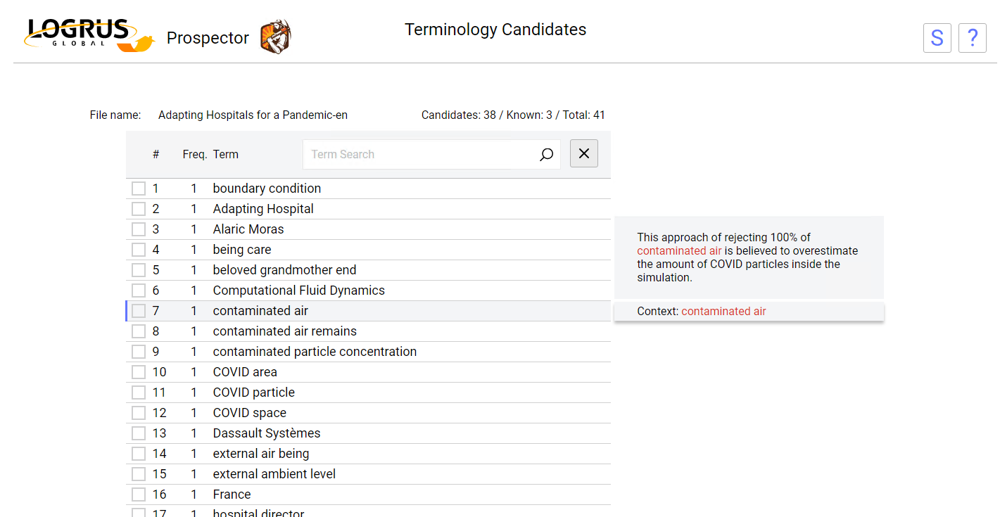

# Prospector: The Terminology Extraction Tool

**Prospector** is among the best available tools for extracting English terminology from source texts. Our registered users can access it at http://prospector.logrusglobal.com.

According to our tests, **Prospector** is about as effecient at extracting terminology as a human **Terminologist** is, at the first pass: the level of efficiency is ~66%. Using **Prospector** enables the **Terminologist** to  mostly automate that first pass, saving a lot of time: they will only need to review the file again and add, possibly, add a couple of missed terms.

Additionally, if a database of existing terms is available, **Prospector** can be set to only extract new terms, saving even more time.

## Using Prospector

**Prospector** is extremely easy to use. As you enter the page, you are prompted to choose a file (possible formats are TXT, HTM/HTML, DOC/DOCX, XLF/XLIFF/SDLXLIFF) or enter a URL for extracting terminology from.

Next step is to pick existing databases, which will be used to exclude terms from the list of candidates, and to press the **Extract Terminology** button.

Then, you will be presented with the list containing all the terminology candidates:

This list is for a **Terminologist** to go through, reviewing extracted candidates and setting or clearing the checkbox to include them in the final terminology list.

Reviewing the candidate list is helped by the following function: when a candidate line on the list is selected, **Prospector** will display its context string in a tab to the right. This helps the **Terminologist** decide if the candidate is a real term or a false positive. Additionally, a candidate term can be edited by pressing Enter or double clicking its line.

After the candidate list has been reviewed, pressing the **Save** button will generate an XLSX file containing all the chosen candidates.