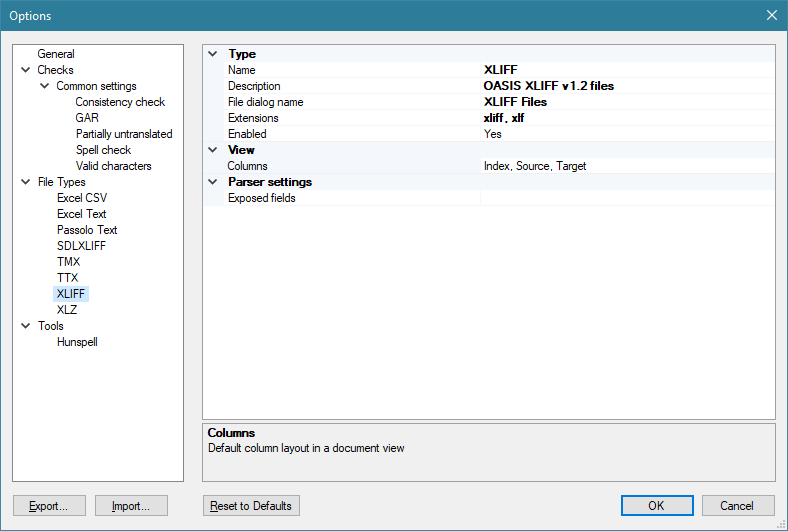
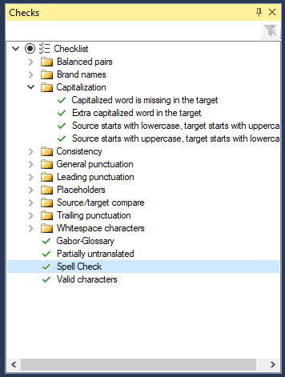
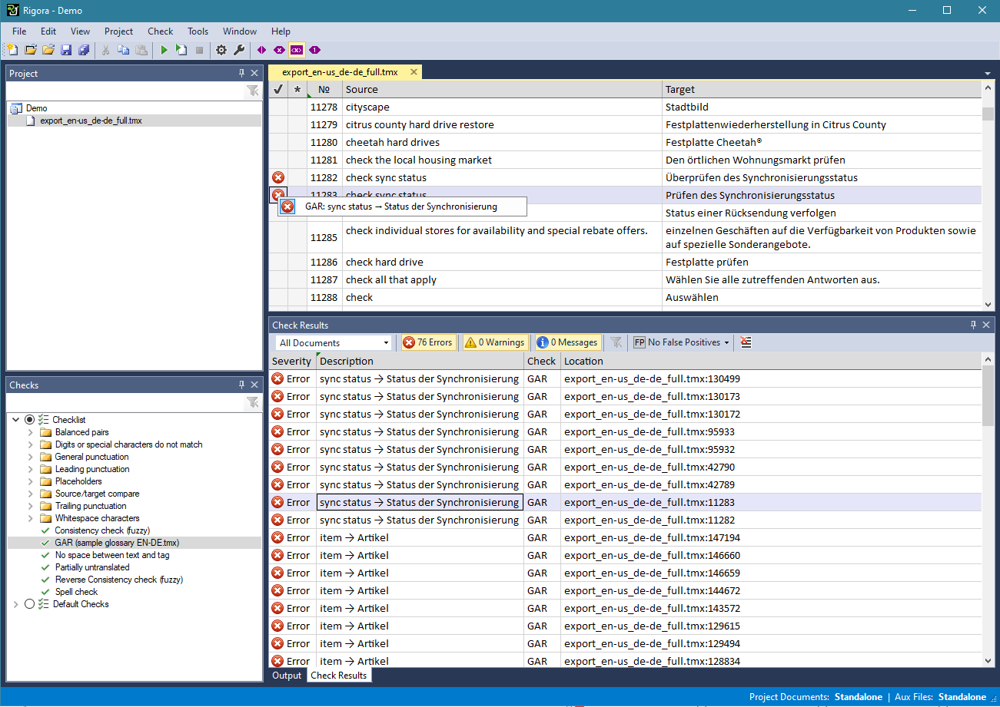
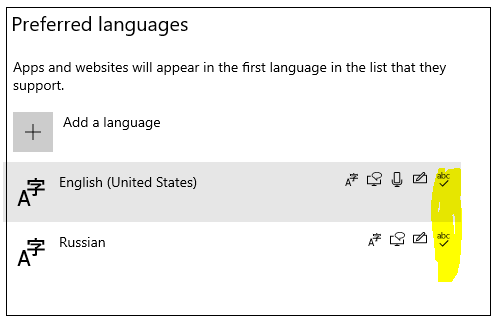
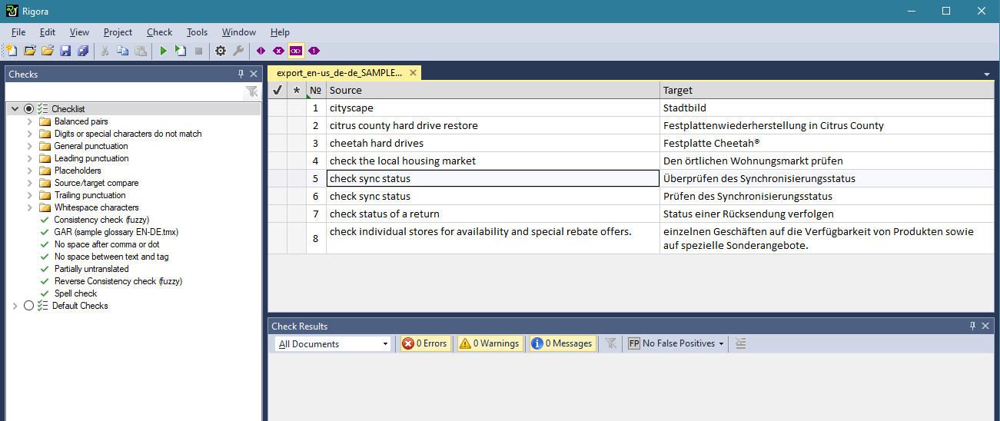
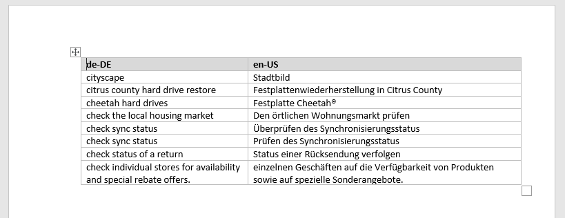
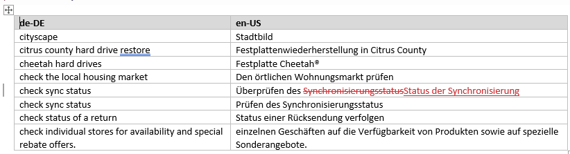

# Rigora: The Ultrapowerful QA Tool

**Rigora** is an ultrapowerful desktop localization QA tool.

Built on top of decades of localization engineering experience of the Logrus software developers and engineers (and recently, completely rewritten and drastically improved), **Rigora** enables you to perfrom the most advanced technical and linguistic checks on localized files, to fix errors interactively, and to do so in batch mode. **Rigora** can work with entire projects, as well as with singular files, making it an extremely convenient default editor for the XLIFF file format.

It is an interactive tool, and it ranks among the most powerful tools for working with software and text content.

You can visit the official website of **Rigora** here: [www.rigora.stido](http://www.rigora.studio)

## Supported File Formats

- Common bilingual file formats (XLIFF, SDLXLIFF, TMX, TTX)

- Excel workbooks

- Configurable parsing of arbitrary XML and delimited text formats

*Some of the file types supported by Rigora*

## Projects

**Rigora** supports two types of projects that differ from each oher drastically, including the difference with their handling of files: projects with embedded changes and projects with in-file changes (absolute and relative).

A project with embedded changes does not make any changes to its files.

A project with in-file changes contains only a list of file locations and settings, with all the changes going directly into its files.

## Checks

**Rigora** runs more than 300 checks, all of them customizable. Among them are:

- Common checks (punctuation, tag and placeholder matching, etc.), configurable for various language pairs

- Check for invalid characters based on the target language alphabet

- Check for partially untranslated source words

- Consistency check, direct and reverse

- TM consistency checks

- Glossary Adherence Review (GAR) with stemming support, checking against external glossaries and in-project (using all project translations as a glossary)

- Checks for prohibited terms

You can fine-tune them from the Checks window:

The GAR check is very powerful, verifying the correct translation of all terms listed in TMX.

### In-place editing

As you run the checks, individual errors are shown in Check Results window. 

As you walk through them, they are highlighted in the files. **Rigora** opens each file and highlights the string that contains the error. When you fix an error, it is removed from Checks Results window.

*Rigora finds several problems with string 11067*

*Rigora shows untranslated text in Japanese translations*

After an error has been fixed, **Rigora** automatically re-checks the translation unit.

### False Positives

You can right-click an error in Check Results windows and mark it as False Positive. The error will then be removed from the list.

### Spell Checking

**Rigora** uses the Windows 10 spell checker by default:

*System spell checker is on by default*

To enable this, the document language must be the default system language (check Start > Settings  > Time & Language > Language).

You can also use Hunspell dicrionaries, which are set up separately.

### Export / Import Features

**Rigora** is very good at exporting various file formats. For example, you can export the contents of a XLIFF file as an Excel or TMX file, or export unique records only to remove duplicates.

## Software Updates

When translating software, **Rigora** can do 100% matching updates of software strings, autotranslate ICE matches by TMX files (“software dictionary”, translated before).

## Keeping Track of the Translation Editing History at Every Stage, for Every Document Format

It is often necessary to keep track of how an editor makes changes to the document after receiving it from the translator - as well as keeping track of the document, in general, at all stages of the translation process. This is relevant for regular editors as well as MT post-editors. CAT tools often do not keep track of who exactly changes what (sometimes they do, but the process is often inconvenient).

**Rigora** solves this issue through its new function. It is used to covnert a duolingual XLIFF file into a MS Word document containting a table with two columns: source and translation. XLIFF files can be obtained easily from most CAT tools, as they enalbe the user to export a project as a set of XLIFF files at any stage of the project. So, in order to compare two versions of a document from different stages of its project, you can simply convert the XLIFF files to the DOCX format and then use the standard document-comparing function of MS Word. If you do a XLIFF export of your CAT project after the translation is done, and then another after the editing is done, you will be able to visualize everything that the editor had deemed right to fix in every document. 

*You can convert a XLIFF file into a DOCX file using the File -> Export Items option with the Word Document file type.*

*This is what a DOCX file covnerted from XLIFF looks like.*

*Use the Review -> Compare option in MS Word to compare the changes between two DOCX files belonging to different versions of a document.*

Most CAT sytems do not offer the means of viewing versions of a document from different project stages, let alone a convenient way to view a history of changes. Making project snapshots in XLIFF format is an easy-to-use solution, available to everyone. 

The XLIFF format is especially convenient, as it enables visualizing a history of changes made to files of any format during the translation process. If you elect to use the XLIFF-to-DOCX convertion, you will be able to:

- give edited files back to your translators for future reference, with any mistakes commented on in the DOCX files by the editors

- provide your layout designers with clearly pointed out last-minute fixes for translations

- evaluate the work of your MT post-editors

- snapshot any translations out of your CAT system and provide them to your reviewers for checking in the simple DOCX format - without the trouble of arranging their access to your CAT system (or training them in its use)